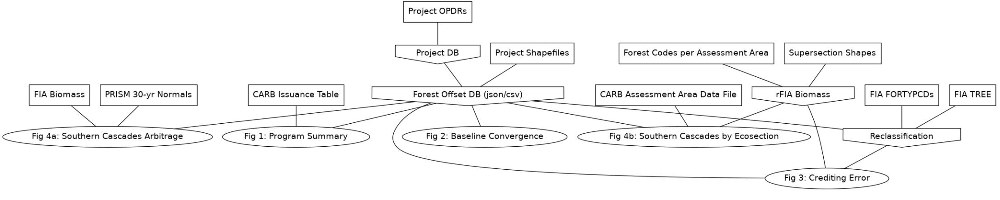

# carbonplan / forest-offsets

**analysis of forest offset projects**

[](https://github.com/carbonplan/forest-offsets/actions/workflows/main.yaml)
[](./LICENSE)
[](https://doi.org/10.5281/zenodo.4628605)

This repository includes our libraries and scripts for analyzing California's compliance forest carbon offsets program. This work is described in more detail in a [web article](https://carbonplan.org/research/forest-offsets-explainer) and a [preprint](https://carbonplan.org/research/forest-offsets-explainer). See the [carbonplan/forest-offsets-paper](https://github.com/carbonplan/forest-offsets-paper) repository for Jupyter notebooks that specifically recreate all the figures in the preprint. You can also browse some of these data and results in an [interactive web map](https://carbonplan.org/research/forest-offsets).

## install

From PyPI:

```shell
pip install carbonplan_forest_offsets
```

or from source:

```shell
pip install git+https://github.com/carbonplan/forest-offsets.git
```

## data sources

All data sources used in this project are described in [this](./carbonplan_forest_offsets/data/catalog.yaml) Intake Catalog. A schematic representing the primary input datasets and outputs is shown below for reference.



## data products

See the following Zenodo archives for descriptions of the data products produced by this project:

- G Badgley, J Freeman, J J Hamman, B Haya, D Cullenward (2021) California improved forest management offset project database (Version 1.0) https://doi.org/10.5281/zenodo.4630684.
- G Badgley, et al. (2021) Systematic over-crediting in California’s forest carbon offsets program (Version 1.0) https://doi.org/10.5281/zenodo.4630712.

## environments

This project uses the Python and R programing languages. Environment specifications are included in the `envs/` directory and pre-built Docker images are available on Dockerhub:

- [retro-python-notebook](https://hub.docker.com/repository/docker/carbonplan/retro-python-notebook)
- [retro-r-notebook](https://hub.docker.com/repository/docker/carbonplan/retro-r-notebook)

## license

All the code in this repository is [MIT](https://choosealicense.com/licenses/mit/) licensed. When possible, the data used by this project is licensed using the [CC-BY-4.0](https://choosealicense.com/licenses/cc-by-4.0/) license. We include attribution and additional license information for third party datasets, and we request that you also maintain that attribution if using this data.

## about us

CarbonPlan is a non-profit organization that uses data and science for climate action. We aim to improve the transparency and scientific integrity of carbon removal and climate solutions through open data and tools. Find out more at [carbonplan.org](https://carbonplan.org/) or get in touch by [opening an issue](https://github.com/carbonplan/forest-offsets/issues/new) or [sending us an email](mailto:hello@carbonplan.org).

## contributors

This project is being developed by CarbonPlan staff and the following outside contributors:

- Grayson Badgley (@badgley)
